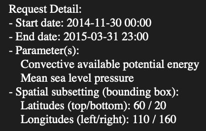
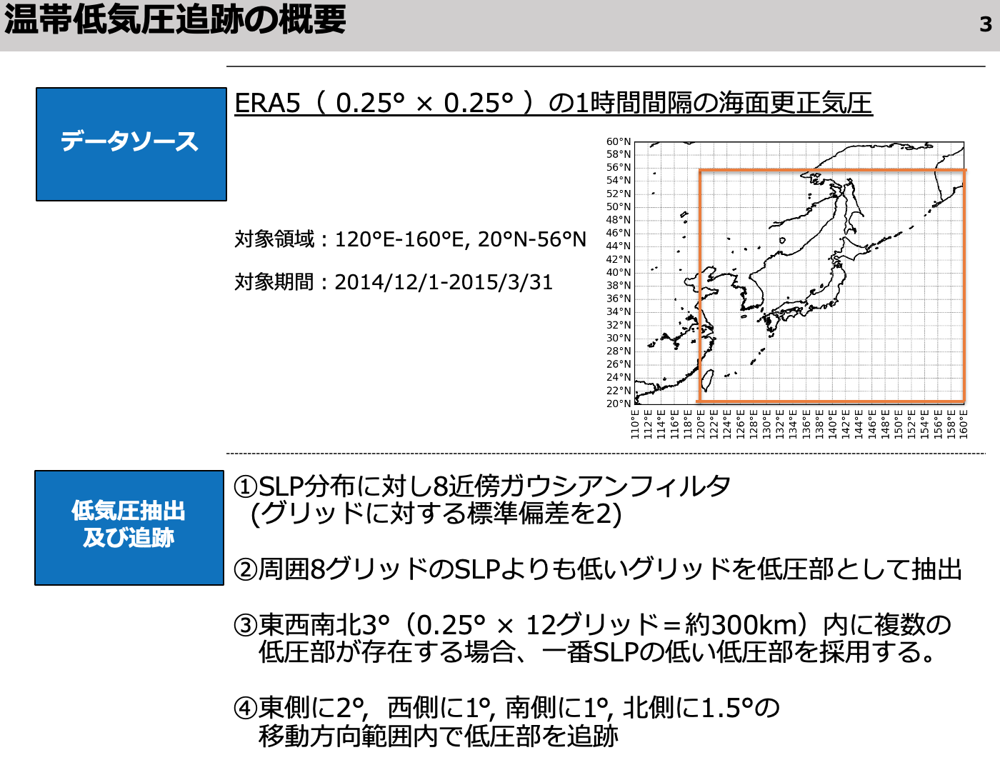
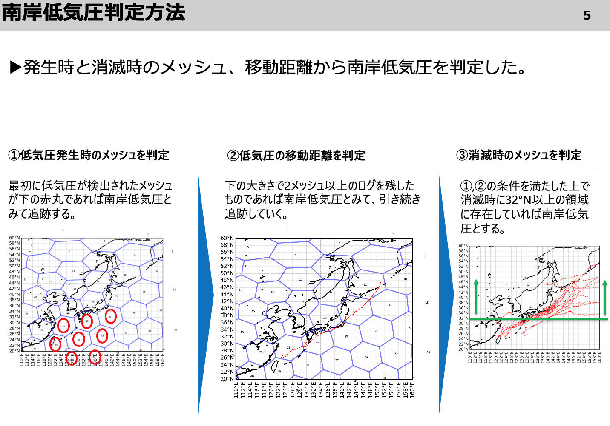
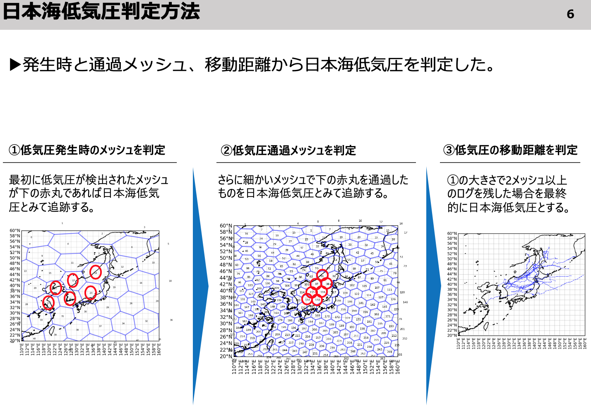
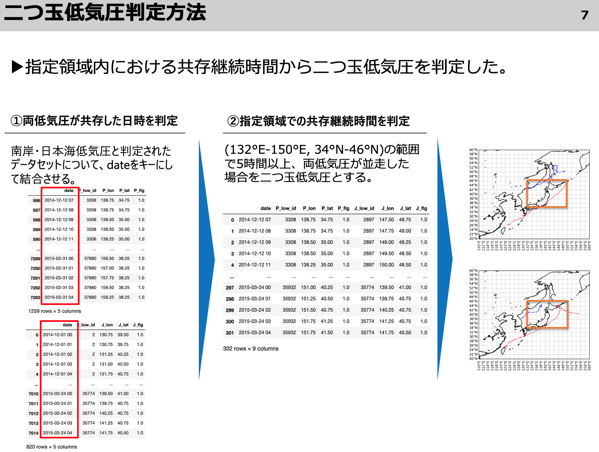
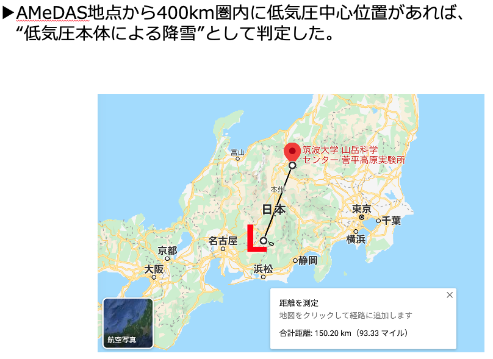
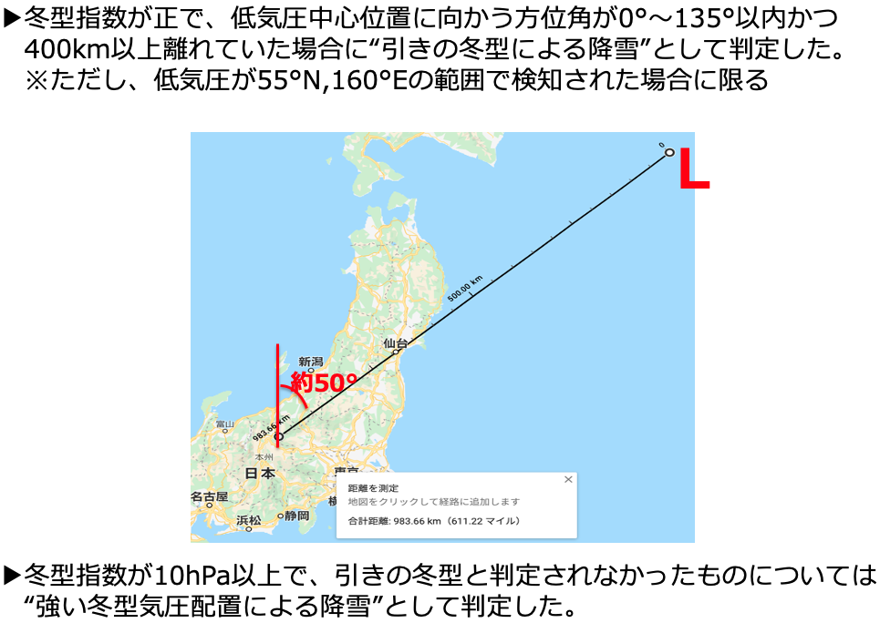

# 冬季温帯低気圧の追跡 / 気圧配置分類プログラム

## 実行手順
1. `config.ini`←入力するデータの設定
2. `low_detection.py`←低圧部抽出
3. `low_tracking.py`←低圧部の追跡
4. `low_classify.py`←低気圧の分類
5. `generate_moi.py`←冬型指数作成
6. `pattern_classify.py`←気圧配置の分類

## 低気圧トラッキングに用いるデータ

**ERA5再解析データの海面更正気圧**

## 温帯低気圧の分類手法

## 気圧配置の分類手法

