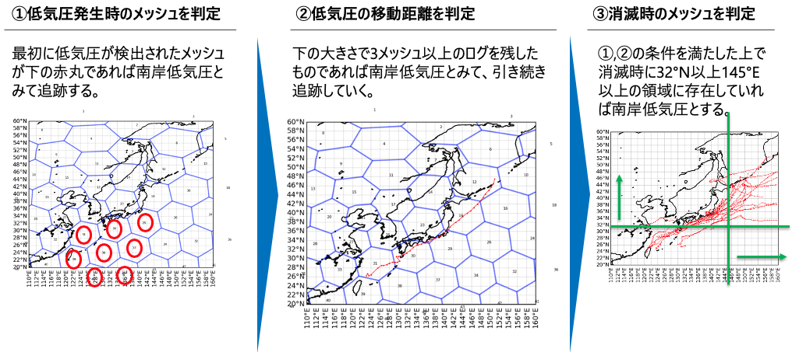
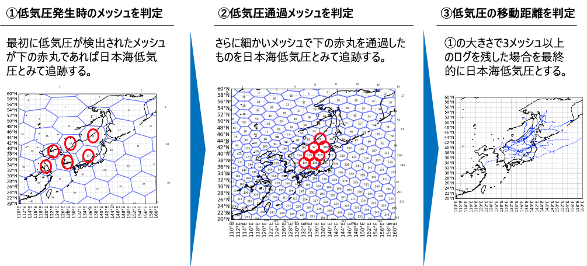

# 冬季温帯低気圧の追跡 / 気圧配置分類プログラム

## 低気圧トラッキングに用いるデータ

**ERA5再解析データの海面更正気圧**

## 温帯低気圧の分類手法

## 気圧配置の分類手法
- **毎時の降雪深データ**
> ["datetime", "date", "station", "h_snow", "lon_s", "lat_s"]

- **冬型指数テーブル**

>["datetime", "WAMOI", "yyyy-mm-dd hh", "yyyy-mm-dd", "hh"]

- **毎時の低気圧トラッキングデータ**

> ["low_id", "datetime", "lon", "lat" ,"hPa", "P_flg", "J_flg", "Double_flg"]
